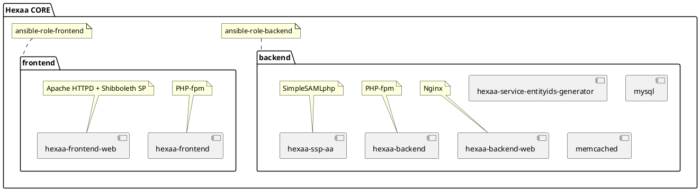

# ansible-hexaa

Ansible playbook for installing a complete HEXAA environment.


## Usage

Requirements:
- a recent version of Docker (`docker.io` or `docker-ce` package)
- Ansible (`pip3 install ansible\>=2.7`)

Installing the roles:

```sh
ansible-galaxy install -r requirements.yml -p ./roles
```


### Local environment

Your user needs to:

* be a member of the `docker` group
* be able to use `sudo` without password (`NOPASSWD` in `/etc/sudoers`)
  or you need to provide your password to Ansible:
  use the `--ask-become-pass` flag and enter it when asked.

**Hostname:**

You should add an entry like this to your `/etc/hosts` config:
```
127.0.0.1	hexaa.local metadata.hexaa.local idp1.hexaa.local idp2.hexaa.local sp1.hexaa.local sp2.hexaa.local mail.hexaa.local
```

**Running:**

```sh
ansible-playbook -i inventory local.yml
```


### Production environment

Your should:

 * copy and customize `group_vars/local`,
 * copy `local.yml` to a matching name (optionally remove the tasks)
 * add your installation target(s) to `inventory` in matching section(s)

If you plan to version control your configuration, you should consider
putting master keys and secrets into an Ansible vault (see the
`ansible-vault(1)` manpage and the `--vault-password-file` option of
`ansible-playbook`).

**Running:**

```sh
ansible-playbook -i inventory <env_name>.yml
```

**Backup:**

You only need to make backups of the contents of `/opt/hexaa/mysql`.


## Development

You can fork the playbook and role repositories, then clone the two
roles into the subdirectory, and make changes to the 3 repositories at
the same time:

```sh
git clone https://github.com/hexaaproject/ansible-hexaa.git
cd ansible-hexaa/roles
git clone https://github.com/hexaaproject/ansible-role-hexaa-frontend.git
git clone https://github.com/hexaaproject/ansible-role-hexaa-backend.git
```


